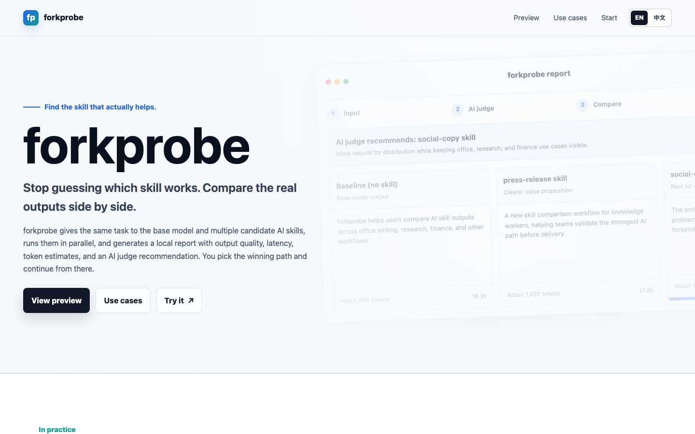
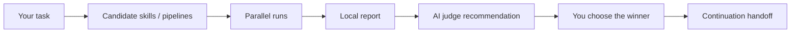

# ForkProbe: AI Skill Selection and Trial-Run Tool

<p align="center">
  <a href="https://jayden-x-l.github.io/forkprobe/?lang=en">
    
  </a>
</p>

<p align="center">
  <strong>Find the skill that actually helps.</strong>
</p>

<p align="center">
  <a href="https://jayden-x-l.github.io/forkprobe/?lang=en">Launch page</a>
  ·
  <a href="./README.md">中文说明</a>
  ·
  <a href="https://jayden-x-l.github.io/forkprobe/downloads/forkprobe-skill.zip">Download skill zip</a>
</p>

<p align="center">
  
  
  
  
</p>

ForkProbe is an AI skill selection and trial-run tool for Agent workflows. It gives the same task to the base model and multiple candidate skills, runs them side by side, generates a local HTML report, and lets you choose the winner before the Agent continues.

**v0.3 adds market research and research report comparison:** research-report pipelines can now generate and compare report previews, sources.json, evidence tables, claim checks, limitations, and AI judge recommendations. v0.2 paper figure and scientific graphics support remains available for PNG previews, SVG/PDF/TIFF exports, source files, captions, and QA notes.

When the skill ecosystem is too crowded to trust descriptions alone, ForkProbe makes the choice visible: compare the real outputs first, then continue with the path you picked.

## When To Use ForkProbe

- You are not sure which skill fits the current task and want to see real outputs first.
- You want to compare the baseline against several skills instead of trusting skill descriptions.
- Your deliverable is a file artifact such as a PPTX deck, scientific figure package, or research report package.
- You want to try a GitHub or bring-your-own skill with a small preflight run.
- It is not meant for simple deterministic tasks where the best tool path is already obvious.

## How It Works



ForkProbe turns skill choice into a visible workflow:

1. Recommend a small set of candidate skills or artifact pipelines.
2. Run the same input through the baseline and each candidate.
3. Show full outputs, latency, token estimates, file previews, and AI judge notes.
4. Let you pick the best path.
5. Generate a continuation handoff so the Agent can keep working from the selected result.

## Try It Naturally

You do not have to remember a command. Say:

```text
Compare a few skills first and see which one fits the current task better.
```

Or be explicit:

```text
Use forkprobe to recommend candidate skills. After I confirm, run them side by side, generate a report, and let me choose the winner.
```

Chinese trigger:

```text
先帮我比较几个 skill，看看哪个更适合当前任务。
```

## Capability Matrix And Candidate Shortlist

The shortlist below follows the current README capability matrix. `baseline` means no extra skill. `+ presentations` and `+ Python/SVG renderer` mean a strategy skill must be paired with a generator to become a complete artifact pipeline. External GitHub candidates should still be checked for license, dependencies, and output paths before execution.

| Scenario | Status | What you see in the report | Recommended candidates |
|---|---|---|---|
| Academic polishing & SCI writing | Supported | Draft variants, AI judge notes, winner selection | `baseline`, `research-paper-writing-skills`, `paper-writer-skill`, [`nature-polishing`](https://github.com/Yuan1z0825/nature-skills/tree/main/skills/nature-polishing), `humanizer` |
| Naturalization & style rewriting | Supported | Side-by-side drafts in different tones and styles | `baseline`, `writing-anti-ai`, `humanizer`, `research-paper-writing-skills` |
| Reviewer response & submission materials | Supported | Response drafts, structure, and tone comparison | `baseline`, [`nature-response`](https://github.com/Yuan1z0825/nature-skills/tree/main/skills/nature-response), `paper-writer-skill`, `writing-anti-ai`, `research-paper-writing-skills` |
| PPTX deck generation | Supported | Openable PPTX files, preview images, candidate notes | `baseline + presentations`, [`nature-paper2ppt`](https://github.com/Yuan1z0825/nature-skills/tree/main/skills/nature-paper2ppt) `+ presentations`, [`academic-pptx-skill`](https://github.com/Gabberflast/academic-pptx-skill) `+ presentations`, [`ppt-master`](https://github.com/hugohe3/ppt-master), [`md-slides`](https://github.com/zl190/md-slides) |
| Paper figures & scientific graphics | Supported | PNG previews, SVG/PDF/TIFF exports, code, captions, QA | `baseline-python-figure`, [`scientific-visualization`](https://github.com/K-Dense-AI/scientific-agent-skills/tree/main/skills/scientific-visualization) `+ Python/SVG renderer`, [`nature-figure`](https://github.com/Yuan1z0825/nature-skills/tree/main/skills/nature-figure) `+ Python/SVG renderer`, `plot-code-python`, `schematic-svg`, `graphical-abstract-svg` |
| Research reports | Supported | Report previews, sources.json, evidence tables, claim checks, limitations, AI judge notes | `baseline-research-report`, `source-first-research`, `analyst-style-report`, `evidence-table-report`, `company-research-report`, [`user-research-cookiy`](https://github.com/cookiy-ai/user-research-skill) `+ report package` |
| Image generation comparison | Planned | Image previews, file links, candidate notes | No fixed shortlist yet; planned support for image-generation pipelines |
| Web / HTML creation comparison | Planned | Page links, screenshot previews, candidate notes | No fixed shortlist yet; planned support for web/HTML artifact pipelines |

## Four Work Modes

### 1. Text comparison

Use this for academic polishing, naturalization, reviewer responses, submission materials, and PPT plans or outlines.

```bash
python3 scripts/compare.py \
  --input /tmp/forkprobe-input.txt \
  --skill baseline \
  --skill writing-anti-ai \
  --skill research-paper-writing-skills \
  --judge \
  --output /tmp/forkprobe-report.html
```

### 2. PPTX artifact comparison

For "make a PPT" or "generate a PPTX" tasks, ForkProbe should compare finished deck-generation pipelines instead of text-only outlines. Strategy skills must be paired with a generator such as `presentations` or `pptx` before they enter artifact comparison.

Typical shortlist:

- `baseline + presentations`
- `academic-pptx-skill + presentations`
- `nature-paper2ppt + presentations`
- `ppt-master`
- `md-slides`

After each pipeline generates a PPTX, render an artifact report with file links, representative slide previews, and AI judge notes:

```bash
python3 scripts/render_artifact_report.py \
  --manifest /tmp/forkprobe-ppt-artifacts.json \
  --output /tmp/forkprobe-ppt-report.html
```

### 3. Figure artifact comparison

For paper figures, scientific graphics, mechanism diagrams, data plots, or graphical abstracts, ForkProbe compares figure-generation pipelines. Each candidate writes a figure package that the report can show with previews, source files, captions, and QA notes.

```bash
python3 scripts/figure_artifact.py \
  --input /tmp/forkprobe-figure-task.txt \
  --pipeline baseline-python-figure \
  --pipeline nature-figure-python \
  --pipeline plot-code-python \
  --skill-source 'https://github.com/K-Dense-AI/scientific-agent-skills#skills/scientific-visualization' \
  --run \
  --judge \
  --render-report \
  --report-output /tmp/forkprobe-figure-report.html
```

Expected outputs include `preview.png`, `figure.svg`, `figure.pdf` or `figure.tiff`, source code or vector files, `caption.md`, and `qa.md`.

### 4. Research report artifact comparison

For market research, company research, competitive analysis, user research, literature reviews, or investment research reports, ForkProbe compares research-report pipelines. Each candidate writes a research package, and the report shows report previews, sources, evidence tables, claim checks, limitations, and AI judge notes.

First recommend candidates and wait for user confirmation:

```bash
python3 scripts/recommend.py --input /tmp/forkprobe-research-task.txt
```

After the user confirms the shortlist, run the research artifact pipelines:

```bash
python3 scripts/research_artifact.py \
  --input /tmp/forkprobe-research-task.txt \
  --pipeline baseline-research-report \
  --pipeline source-first-research \
  --pipeline analyst-style-report \
  --pipeline evidence-table-report \
  --confirmed \
  --run \
  --judge \
  --render-report \
  --report-output /tmp/forkprobe-research-report.html
```

Expected outputs include `candidate-report.md`, `candidate-report.html`, `sources.json`, `evidence-table.md`, `claim-checks.md`, `limitations.md`, and `summary.md`.

## Supported Agent Workflows

- Claude Code / Claude-style skill sessions
- Codex native execution, with fallback to the OpenAI API
- Natural-language Agent surfaces such as OpenClaw, WorkBuddy, OpenCode, and similar platforms
- Artifact comparisons for generated PPTX, scientific figure packages, research report packages, and other file outputs

## Installation

Install as a local skill by copying this folder into your Agent skill directory:

```bash
cp -r forkprobe ~/.claude/skills/
```

For Codex or local Agent skill setups:

```bash
cp -r forkprobe ~/.agents/skills/
```

Install the core dependency:

```bash
pip3 install jinja2
```

The Codex App / Codex CLI path uses local `codex exec` first, inheriting your Codex login and model configuration. It does not require `OPENAI_API_KEY`.

Optional dependencies for Claude SDK or API fallback paths:

```bash
pip3 install claude-agent-sdk
pip3 install anthropic openai
```

The `openai` SDK and `OPENAI_API_KEY` are only used when Codex native CLI is unavailable or disabled and ForkProbe falls back to the OpenAI API.

## Quick Start

Create an input file:

```bash
echo "Polish this paragraph and keep the meaning unchanged." > /tmp/forkprobe-input.txt
```

Ask ForkProbe to recommend candidates:

```bash
python3 scripts/recommend.py --input /tmp/forkprobe-input.txt
```

After confirming the candidates, run a local text comparison:

```bash
python3 scripts/compare.py \
  --input /tmp/forkprobe-input.txt \
  --skill baseline \
  --skill writing-anti-ai \
  --judge \
  --output /tmp/forkprobe-report.html
```

Open the local report:

```bash
open /tmp/forkprobe-report.html
```

## BYO, GitHub Discovery, And Local-Only

Before running a comparison, `scripts/recommend.py` can recommend candidates. By default, it combines local curated candidates with GitHub/network discovery using sanitized task signals. It does not send the raw task text as a search query.

```bash
python3 scripts/recommend.py --input /tmp/forkprobe-input.txt
```

For local-only discovery:

```bash
python3 scripts/recommend.py --input /tmp/forkprobe-input.txt --local-only
```

Bring-your-own skills can be local paths, GitHub URLs, `repo#subdir` references, or raw `SKILL.md` URLs, for example:

```text
https://github.com/Yuan1z0825/nature-skills#skills/nature-polishing
```

## Reports, Winners, And Handoffs

ForkProbe's main output is a local HTML report. Text mode shows each complete output, latency, token estimates, and AI judge notes. Artifact mode shows PPTX or figure-package links, previews, candidate notes, captions, QA, and judge recommendations.

After you choose a winner in the report, ForkProbe records a local verdict and creates a continuation handoff. The current Agent can then keep working from the selected style, structure, or artifact path.

For market research, company research, competitive analysis, user research, literature reviews, or investment research reports, forkprobe can compare research-report pipelines. Important: first use the recommender to show candidates and wait for user confirmation; do not run `research_artifact.py --run` directly.

```bash
python3 scripts/recommend.py --input /tmp/forkprobe-research-task.txt
```

After the user confirms, each candidate writes a research package, and the report shows report previews, sources, evidence tables, claim checks, limitations, and AI judge notes:

```bash
python3 scripts/research_artifact.py \
  --input /tmp/forkprobe-research-task.txt \
  --pipeline baseline-research-report \
  --pipeline source-first-research \
  --pipeline analyst-style-report \
  --pipeline evidence-table-report \
  --confirmed \
  --run \
  --judge \
  --render-report \
  --report-output /tmp/forkprobe-research-report.html
```

Expected outputs include `candidate-report.md`, `candidate-report.html`, `sources.json`, `evidence-table.md`, `claim-checks.md`, `limitations.md`, and `summary.md`.

## Privacy

- Task content stays local in the report and local logs.
- GitHub/network discovery uses sanitized task signals, not the raw document.
- Local verdict logs store the selected winner, optional reason, report path, and continuation handoff.
- Use `--local-only` or ask for local-only candidates to skip network discovery.
- Use `--no-server` to render reports without the local verdict-capture server.
- See [SECURITY.md](./SECURITY.md) for loopback server, token, CORS, remote fetch, and command-execution notes.

## Tests

```bash
python3 tests/test_smoke.py
```

Integration tests require real model/API access:

```bash
FORKPROBE_RUN_INTEGRATION=1 python3 tests/test_integration.py
```

## Project Structure

```text
docs/       GitHub Pages launch page and screenshots
scripts/    comparison, recommendation, report, and verdict helpers
templates/  HTML report template
catalog/    curated skill catalogs
tests/      smoke and integration tests
SKILL.md    Agent skill instructions
```

## License

MIT. See [LICENSE](./LICENSE).
