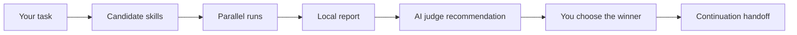

# forkprobe

<p align="center">
  
</p>

<p align="center">
  <strong>Find the skill that actually helps.</strong>
</p>

<p align="center">
  <a href="https://jayden-x-l.github.io/forkprobe/?lang=en">Launch page</a>
  ·
  <a href="./README.zh-CN.md">中文说明</a>
  ·
  <a href="https://jayden-x-l.github.io/forkprobe/downloads/forkprobe-skill.zip">Download skill zip</a>
</p>

<p align="center">
  
  
  
</p>

forkprobe is an A/B testing skill selector for Agent workflows. It gives the same task to the base model and multiple candidate skills, runs them side by side, generates a local HTML report, and lets you choose the winner before the Agent continues.

It is useful when the skill ecosystem is too crowded to trust descriptions alone: office writing, research polishing, financial analysis, PPT planning, PPTX artifact generation, and other workflows where the right skill changes the final output.

## How It Works



forkprobe turns skill choice into a visible workflow:

1. Recommend a small candidate set.
2. Run the same task through baseline and several skills.
3. Show full outputs, latency, token estimates, and AI judge notes.
4. Let you pick the best path.
5. Generate a continuation handoff so the Agent can keep working from the selected result.

## Try It Naturally

You do not have to remember a command. Say:

```text
Compare a few skills first and see which one fits the current task better.
```

Or be explicit:

```text
Use forkprobe to recommend candidate skills. After I confirm, run them side by side, generate a report, and let me choose the winner.
```

Chinese trigger:

```text
先帮我比较几个 skill，看看哪个更适合当前任务。
```

## Supported Workflows

- Claude Code / Claude-style skill sessions
- Codex native execution, with fallback to the OpenAI API
- Natural-language Agent surfaces such as OpenClaw, WorkBuddy, OpenCode, and similar platforms
- Artifact comparisons for generated PPTX and other file outputs

## Installation

Install as a local skill by copying this folder into your Agent skill directory:

```bash
cp -r forkprobe ~/.claude/skills/
```

For Codex or local Agent skill setups:

```bash
cp -r forkprobe ~/.agents/skills/
```

Install dependencies:

```bash
pip3 install jinja2 anthropic openai
```

Optional for Claude SDK execution:

```bash
pip3 install claude-agent-sdk
```

## Quick Start

Create an input file:

```bash
echo "Polish this paragraph and keep the meaning unchanged." > /tmp/forkprobe-input.txt
```

Run a comparison:

```bash
python3 scripts/compare.py \
  --input /tmp/forkprobe-input.txt \
  --skill baseline \
  --skill writing-anti-ai \
  --judge \
  --output /tmp/forkprobe-report.html
```

Open the local report:

```bash
open /tmp/forkprobe-report.html
```

## Candidate Recommendation

Before running a comparison, forkprobe can recommend candidates:

```bash
python3 scripts/recommend.py --input /tmp/forkprobe-input.txt
```

By default, recommendation combines local curated candidates with GitHub/network discovery using sanitized task signals. It does not send the raw task text as a search query.

For local-only discovery:

```bash
python3 scripts/recommend.py --input /tmp/forkprobe-input.txt --local-only
```

## Artifact Comparison

For "make a PPT" tasks, forkprobe can route to artifact comparison instead of text-only outline comparison. It can discover strategy skills, generators, and full pipelines, then render a report from generated files:

```bash
python3 scripts/render_artifact_report.py \
  --manifest /tmp/forkprobe-ppt-artifacts.json \
  --output /tmp/forkprobe-ppt-report.html
```

## Privacy

- Task content stays local in the report and local logs.
- GitHub/network discovery uses sanitized task signals, not the raw document.
- Local verdict logs store the selected winner, optional reason, report path, and continuation handoff.
- Use `--local-only` or ask for local-only candidates to skip network discovery.
- Use `--no-server` to render reports without the local verdict-capture server.
- See [SECURITY.md](./SECURITY.md) for loopback server, token, CORS, remote fetch, and command-execution notes.

## Tests

```bash
python3 tests/test_smoke.py
```

Integration tests require real model/API access:

```bash
FORKPROBE_RUN_INTEGRATION=1 python3 tests/test_integration.py
```

## Project Structure

```text
docs/       GitHub Pages launch page and screenshots
scripts/    comparison, recommendation, report, and verdict helpers
templates/  HTML report template
catalog/    curated skill catalogs
tests/      smoke and integration tests
SKILL.md    Agent skill instructions
```

## License

MIT. See [LICENSE](./LICENSE).
