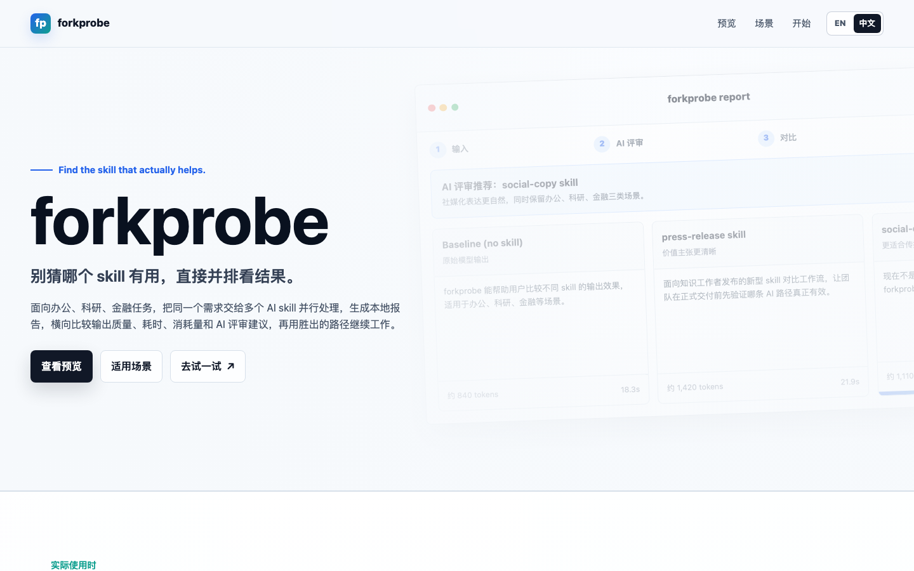
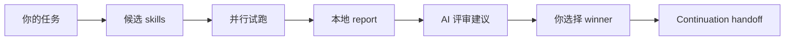

# ForkProbe：AI Skill 选型与试跑工具

<p align="center">
  
</p>

<p align="center">
  <strong>别猜哪个 AI Skill 有用，直接并排看结果。</strong>
</p>

<p align="center">
  <a href="https://jayden-x-l.github.io/forkprobe/?lang=zh">发布页</a>
  ·
  <a href="./README.en.md">English README</a>
  ·
  <a href="https://jayden-x-l.github.io/forkprobe/downloads/forkprobe-skill.zip">下载 skill zip</a>
</p>

<p align="center">
  
  
  
  
</p>

ForkProbe 是一个 AI Skill 选型与试跑工具。它会把同一个任务交给模型本身和多个候选 skill，并排试跑，生成本地 HTML report，让你看到真实输出之后再选择 winner。

**v0.2 新增支持论文作图 / 科研绘图对比：** figure pipeline 可以生成并横向比较 PNG 预览、SVG/PDF/TIFF 导出、源文件、caption、QA 和 AI 评审建议。

当网络上的 skill 越来越多时，问题不再是“有没有 skill”，而是“当前任务到底该用哪个 skill”。forkprobe 的目标很直接：先把结果摊开，再让 Agent 沿着你选中的路径继续工作。

## 它怎么工作



forkprobe 把 skill 选择变成一个可观察的流程：

1. 根据当前任务推荐少量候选 skill。
2. 用同一份输入跑 baseline 和多个 skill。
3. 展示每一路完整输出、耗时、token 估算和 AI 评审建议。
4. 由你选择 winner。
5. 生成 continuation handoff，让 Agent 继续执行正式任务。

## 一句话触发

你不需要记命令。直接对 Agent 说：

```text
先帮我比较几个 skill，看看哪个更适合当前任务。
```

或者更明确一点：

```text
请用 forkprobe 推荐候选，等我确认后再并排执行并生成 report，让我选择 winner。
```

英文触发：

```text
Compare a few skills first and see which one fits the current task better.
```

## 适合什么场景

- 办公方向：产品方案、GTM、会议纪要、市场分析、内部宣传、汇报 PPT
- 科研方向：SCI 润色、英文摘要、Nature 风格、审稿回复、论文作图 / 科研绘图、科研 PPT
- 金融方向：持仓数据、行业报告、财报摘要、风险敞口、投委会材料
- 成品对比：PPTX、科研 figure package、文档、长图等生成型 artifact 的横向比较

## 支持的 Agent 工作流

- Claude Code / Claude 风格 skill 会话
- Codex 原生执行路径，并在失败时 fallback 到 OpenAI API
- OpenClaw、WorkBuddy、OpenCode 等自然语言 Agent 工作流
- “做一个 PPT”和“生成论文 figure”这类成品生成任务的 artifact comparison

## 能力矩阵

| 场景 | 状态 | Report 里看到什么 |
|---|---|---|
| 学术润色与 SCI 写作 | 已支持 | 多版本文本、AI 评审、winner 选择 |
| 自然化与风格改写 | 已支持 | 不同风格稿件并排比较 |
| 审稿回复与投稿材料 | 已支持 | 回复草稿、结构、语气对比 |
| PPTX 成品生成 | 已支持 | 可打开的 PPTX、预览图、候选说明 |
| 论文作图 / 科研绘图 | 已支持 | PNG 预览、SVG/PDF/TIFF、代码、caption、QA |
| 图片生成 / 生图比较 | 规划中 | 图片预览、文件链接、候选说明 |
| 网页 / HTML 制作比较 | 规划中 | 页面链接、截图预览、候选说明 |

## 安装

将本项目复制到你的 Agent skill 目录即可。

Claude Code：

```bash
cp -r forkprobe ~/.claude/skills/
```

Codex / 本地 Agent skill 目录：

```bash
cp -r forkprobe ~/.agents/skills/
```

安装依赖：

```bash
pip3 install jinja2 anthropic openai
```

如果要走 Claude SDK 执行路径，可选安装：

```bash
pip3 install claude-agent-sdk
```

## 快速开始

创建输入文件：

```bash
echo "请润色这段文字，并保留原意。" > /tmp/forkprobe-input.txt
```

运行一次本地对比：

```bash
python3 scripts/compare.py \
  --input /tmp/forkprobe-input.txt \
  --skill baseline \
  --skill writing-anti-ai \
  --judge \
  --output /tmp/forkprobe-report.html
```

打开 report：

```bash
open /tmp/forkprobe-report.html
```

## 候选 Skill 推荐

在正式对比前，forkprobe 可以先推荐候选：

```bash
python3 scripts/recommend.py --input /tmp/forkprobe-input.txt
```

默认情况下，它会合并本地 curated 候选和 GitHub / 网络发现结果。网络搜索只使用经过清洗的任务信号，不会直接拿你的原始文档做搜索词。

如果只想使用本地候选：

```bash
python3 scripts/recommend.py --input /tmp/forkprobe-input.txt --local-only
```

## PPTX / Artifact 对比

如果用户目标是“做一个 PPT”或“生成 PPTX”，forkprobe 会倾向比较成品生成 pipeline，而不是只比较文字大纲。它可以发现策略 skill、生成器和完整 pipeline，并从生成文件渲染 artifact report：

```bash
python3 scripts/render_artifact_report.py \
  --manifest /tmp/forkprobe-ppt-artifacts.json \
  --output /tmp/forkprobe-ppt-report.html
```

如果目标是论文作图或科研绘图，forkprobe 可以比较 figure 生成 pipeline 和外部 figure skill。每条候选路径会生成一个 figure package，用 report 展示预览、源文件、caption 和 QA：

```bash
python3 scripts/figure_artifact.py \
  --input /tmp/forkprobe-figure-task.txt \
  --pipeline baseline-python-figure \
  --pipeline nature-figure-python \
  --pipeline schematic-svg \
  --skill-source https://github.com/example/figure-skill#skills/scientific-figure \
  --run \
  --judge \
  --render-report \
  --report-output /tmp/forkprobe-figure-report.html
```

推荐产物包括 `preview.png`、`figure.svg`、`figure.pdf` 或 `figure.tiff`、源代码或矢量源文件、`caption.md` 和 `qa.md`。

## 隐私

- 任务内容保留在本地 report 和本地日志里。
- GitHub / 网络发现只使用清洗后的任务信号，不直接使用原始文档。
- 本地 verdict 日志只记录 winner、可选理由、report 路径和 continuation handoff。
- 如果不想联网，可以使用 `--local-only`，或明确说“只要本地候选”。
- 如果不想启动本地 verdict-capture server，可以使用 `--no-server`。
- 本地回写 token、CORS、远程 fetch 和命令执行说明见 [SECURITY.md](./SECURITY.md)。

## 测试

Smoke tests：

```bash
python3 tests/test_smoke.py
```

Integration tests 需要真实模型/API 访问：

```bash
FORKPROBE_RUN_INTEGRATION=1 python3 tests/test_integration.py
```

## 项目结构

```text
docs/       GitHub Pages 发布页和截图
scripts/    对比、推荐、报告和 verdict 工具
templates/  HTML report 模板
catalog/    curated skill catalog
tests/      smoke / integration tests
SKILL.md    Agent skill 指令
```

## License

MIT，见 [LICENSE](./LICENSE)。
